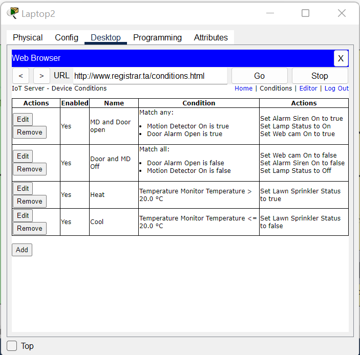

# IoT-Network
This project is a single Cisco Packet Tracer file that consists of a Smart Home System.
The Smart Home System utilizes the features associated with IoT devices which are configured using Python and connected using basic Networking principles.

The Internet side of the Network consists of the following:
  Server-PT: (Registrar svr)
  Server-PT: (Cloud DNS svr)
  PC-PT: (PC3)
  SMARTPHONE: Smartphone
  2960 IOS15: (S1)

The Home side of the Network consists of the following:
  DLC100: Home gateway
  Server-PT: (DNS svr)
  PC-PT (PC)
  LAPTOP-PT: Laptop
  2960 IOS15: Switch
  SBC-PT: SBC0
  Light: Lamp
  Webcam: Web cam
  Door: Door Alarm
  Siren: Alarm Siren
  Rocker Switch
  Lawn Sprinkler
  Temperature Monitor
  Motion Detector

The component between the Internet side and the Home is:
  Linksys-WRT300N: Wireless Router

# Initial Requirements
the smart home system required had certain requirements that included the ability to monitor and control certain smart devices remotely via a laptop, smartphone or PC. Another requirement of the system was the inclusion of a central hub (SBU) to connect to these devices and utilize it to manage various aspects of the home, such as security, lights, entertainment etc. all data from the design of the system to the information regarding the devices is recorded in the official report.

**Design/Modeling The Smart Home System**
Most PCs, servers and switches were interconnected using the Copper Straight-Through connecter (in the topology image, the connecter is shown between the devices in black color), the SBC was connected with the Light and Webcam using an IoT Custom Cable. The smartphone and routers as well as certain other devices are interconnected wirelessly.

**IoT Configuration**
The topology refers to a right and left side, the latter of which refers to the IoT company providing the services while the former refers to the smart home system. 
The IoT devices are configured to the server on the right (i.e. the company). 
Through the company server, the IoT devices are conditioned to take actions based on certain triggers. (FIG39)

Additionally the SBC on the right is programmed via python (as an example to show functionality). the programming enables the rocker switch tto manipulate the lamp and webcam.
